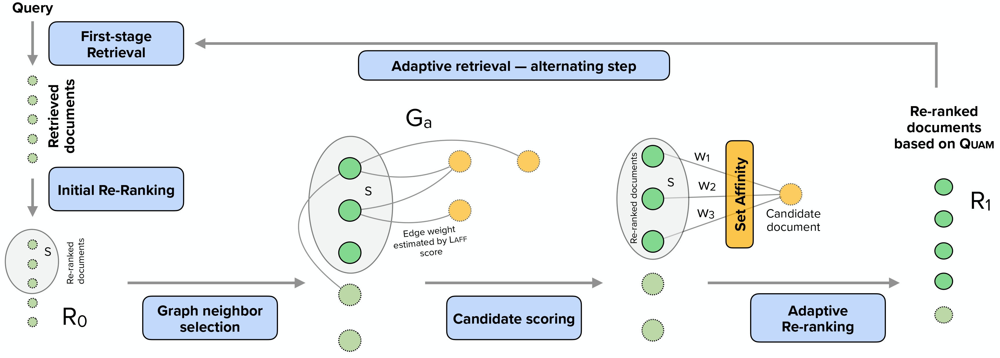

# QuAM: Adaptive Retrieval through Query Affinity Modelling


This is Github repository for our paper [Quam: Adaptive Retrieval through Query Affinity Modelling](https://arxiv.org/pdf/2410.20286)  accepted in 18th ACM International Conference on Web Search and Data Mining (WSDM 2025), Hannover, Germany, 10-14 Mar 2025. 

<p align="center">
  
</p>

## Setup

### Requirements
We have added all dependencies in requirements.txt file which can be downloaded as follows:

```
pip install --upgrade git+https://github.com/terrierteam/pyterrier_t5.git
pip install --upgrade git+https://github.com/terrierteam/pyterrier_adaptive.git
pip install pyterrier_pisa==0.0.6
pip install numpy==1.21.0
pip install pandas==1.4.2
```

### :file_folder: File Structure

```
├── data/
│    ├── laff_train_data/
├── laff_model/
├── saved_pyterrier_runs/
│    ├── gbm25/
│    ├── gtcthnp/
├── base_models.py
├── dataset_utils.py
├── gar_aff.py
├── laff.py
├── pyterrier_quam.py
├── quam_main_fig.jpg
├── requirements.txt
├── run.py
├── train_laff.py
└── README.md
```

## Corpus Graph

We would like to thank the author of the [GAR](https://arxiv.org/pdf/2208.08942) paper for providing the corpus graph. 
We use the same corpus graph for our experiments. 
We start with the 128 neighbours corpus graph (G_c) and create an affinity Graph (G_a).
For instance, the bm25 based corpus graph can be downloaded using:
```
from pyterrier_adaptive import  CorpusGraph
graph = CorpusGraph.from_hf('macavaney/msmarco-passage.corpusgraph.bm25.128')
```


## Training Data for Learnt Affinity Model
The training data can be created using the `laff.py` file. Alternatively, we release the training dataset for learnt affinity model [here](https://zenodo.org/records/13363455) using Zenodo anonymously. The dataset has following files:

1. data-00000-of-00001.arrow
2. dataset_info.json
3. state.json

Please download all 3 files in the `data/laff_train_data/` folder. Further, the dataset can be loaded as

```
import datasets
ds = datasets.load_from_disk("data/laff_train_data")
```

## Learnt Affinity Model
The Learnt affinity model can be trained using the `train_laff.py` file. Alternatively, we have released the model's weights anonymously using Zenodo and can be downloaded from [here](https://zenodo.org/records/13363455). The corresponding file is:

- bert-base-laff.pth

Please download the model in `laff_model/` folder. Further the model can be loaded as follows:

```
from transformers import BertTokenizer, BertForSequenceClassification
from base_models import  BinaryClassificationBertModel

device = torch.device('cuda' if torch.cuda.is_available() else 'cpu')

base_model_name = "bert-base-uncased" 
tokenizer = BertTokenizer.from_pretrained(base_model_name, torch_dtype=torch.float16)
base_model = BertForSequenceClassification.from_pretrained(base_model_name, num_labels=1,torch_dtype=torch.float16)

model = BinaryClassificationBertModel(base_model)
model.load_state_dict(torch.load(f"laff_model/bert-base-laff.pth"))
model.to(device)
```

## Reproduction

Our results can be reproduced by using the `run.py` file. Additionally, we have also provided the saved runs in the  `saved_pyterrier_runs/` folder.

We use the following combinations of budget c and |S|=s:

|budget | s |
| ------ | --- |
| 50 | 10 |
| 100 | 30|
| 1000 | 300|


To reproduce the results for bm25 retriever and corpus graph for TREC DL'19 , run

```
python3 run.py --budget 50 --s 10 --verbose --dl_type 19
```


## Citation
```
@article{rathee2024quam,
      title={Quam: Adaptive Retrieval through Query Affinity Modelling}, 
      author={Mandeep Rathee and Sean MacAvaney and Avishek Anand},
      year={2024},
      eprint={2410.20286},
      archivePrefix={arXiv},
      primaryClass={cs.IR},
      url={https://arxiv.org/abs/2410.20286}, 
}
```

